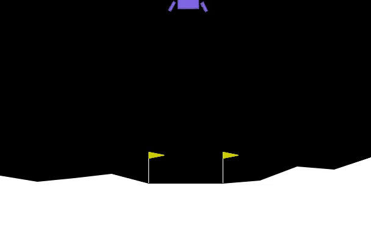

# Space Craft Landing with PPO and GNN

## Model Performance video

## Overview
This project investigates using *Graph Neural Network (GNN) architectures* combined with *Proximal Policy Optimization (PPO)* to solve the Lunar Lander problem. The goal is to assess how GNN policies affect training performance and the spacecraft's landing success rate.

## Methodology

### Proximal Policy Optimization (PPO)
PPO is a popular policy gradient reinforcement learning algorithm known for stable and efficient learning. It is well-suited for control tasks such as Lunar Lander.

### GNN Architecture with PPO
A *Graph Neural Network* was integrated as the policy network for PPO. GNNs are designed to capture spatial and structural relationships in the environment, potentially improving the learning and generalization abilities of the RL agent.

## Results & Observations

- *Training Stability:* The GNN-based PPO policy demonstrated smooth convergence during training, with mean rewards reaching and stabilizing near the environment’s target score (200).
- *Consistent Success Rate:* The *GNN policy* consistently achieved successful landings more frequently than alternative architectures, highlighting its robustness and generalization capacity.
- *Higher Rewards & Robustness:* Utilizing a GNN with PPO resulted in higher mean rewards and better landing success rates on average, indicating that this approach is well-suited for the problem.

## Conclusion

Combining *GNNs with PPO* provides a robust and effective approach to solving the Lunar Lander problem, outperforming other architectures tested. Future work may explore further GNN enhancements or advanced exploration strategies to push the limits of reinforcement learning performance in this domain.
